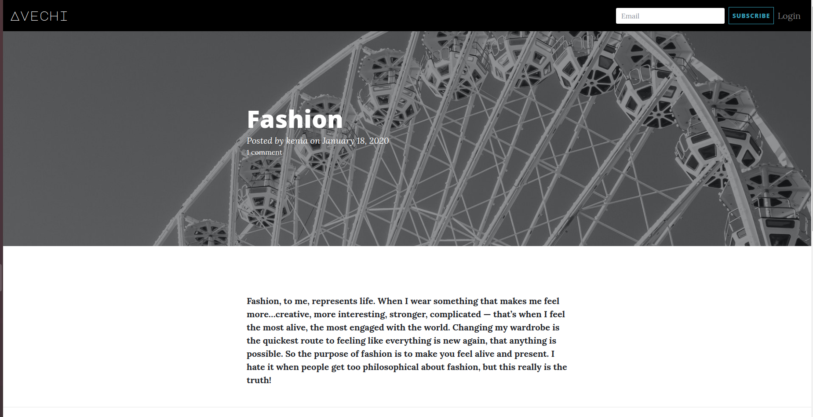
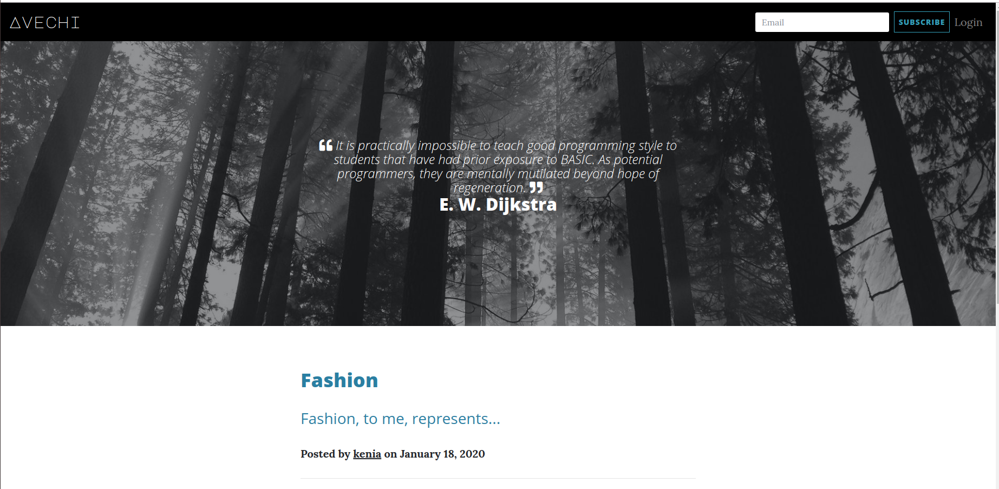
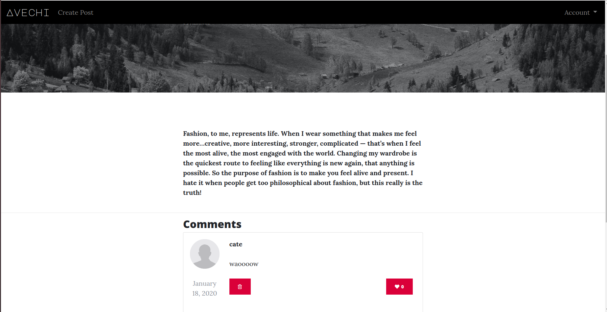
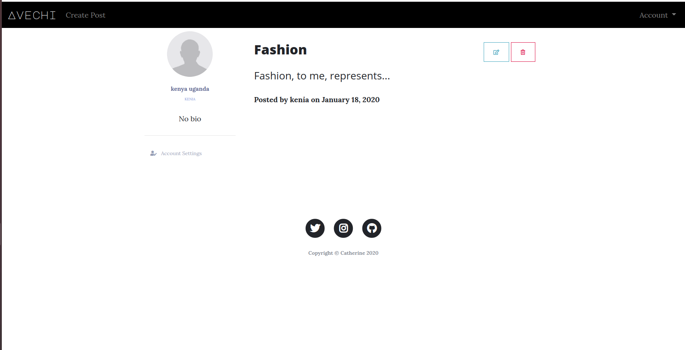

## Project Name 
**Avachi Blog**

## Author
- Catherine Nduku 

## Description 
- This is a for personal blogging website where you can create and share your opinions and other users can read and comment on them.

## User Story in Pictures
####  User view
* User can view the blog posts on the site
* User sees random quotes on the site
* User can view the most recent posts
* User can subscribe to blog mailing list and receives an email alert when a new post is made.
* User can comment on blog posts

####  Writer view
* sign in to the blog.
* create a blog from the application.
* delete comments that I find insulting or degrading
* update or delete blogs I have created.

## Behavior Driven Development

| Input                    | Behaviour                       | Output                                       |
| -------------------------| ------------------------------  | -------------------------------------------- |
| Subscribe to mail list              | Input the email               | Redirect you to the index page               |
| Writer login                    | Take you to home page           | Redirect you to the Homepage                 |
| Create a blog post by filling blog form          | Write your blog and post it to blogs    | Your blog is displayed  in index page                     | 
| User comment on the Blog post plus a nickname | Write your feedback and post it | Your feedback is displayed under the blog post   |
| Writer delete a blog post       | Deleting the blog post from the database    | The blog post will be deleted and not appear on the page                  |
| Writer update a blog post       | Updating the blog post in database    | The blog post will be updated                |
| Writer delete a comment         | Deleting the blog post in database    | The comment will no longer appear under the post    